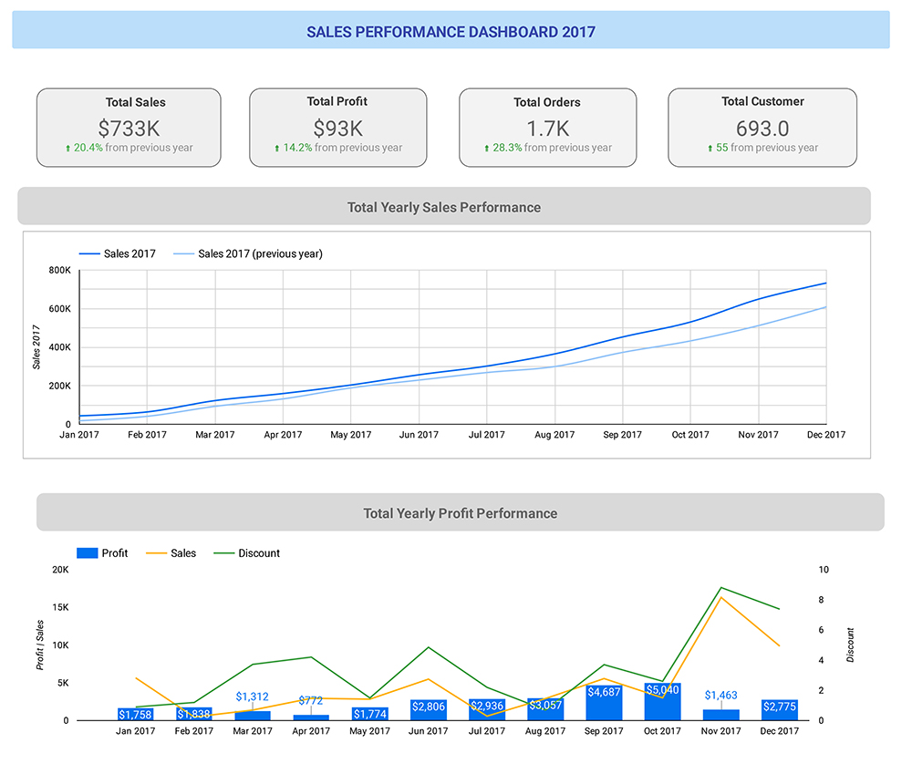

# Superstore Dashboard Analysis
Sample dataset ready in format .xls.

## Overview
Sample dataset from a retail from a global superstore. Dataset ready for 4 years (2015 - 2018). 
The purpose of the analysis is to prepare visualization that can give explanation to managers and stakeholders about the sales over the year, and to help them make insightful prediction for future sales decision. 

## Result
Tools : SQL query using google BigQuery, Data visualizaton using Looker Studio (GDS). 
Full dashboard can be accesed here 

