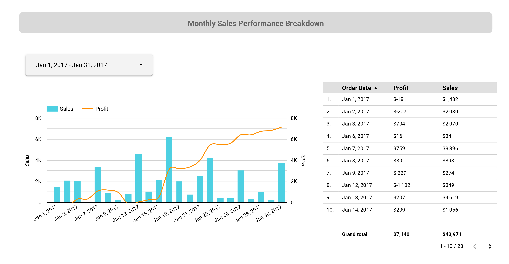
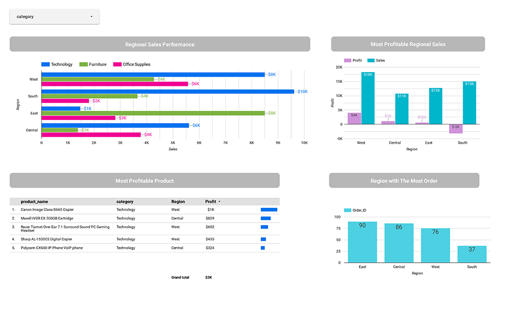
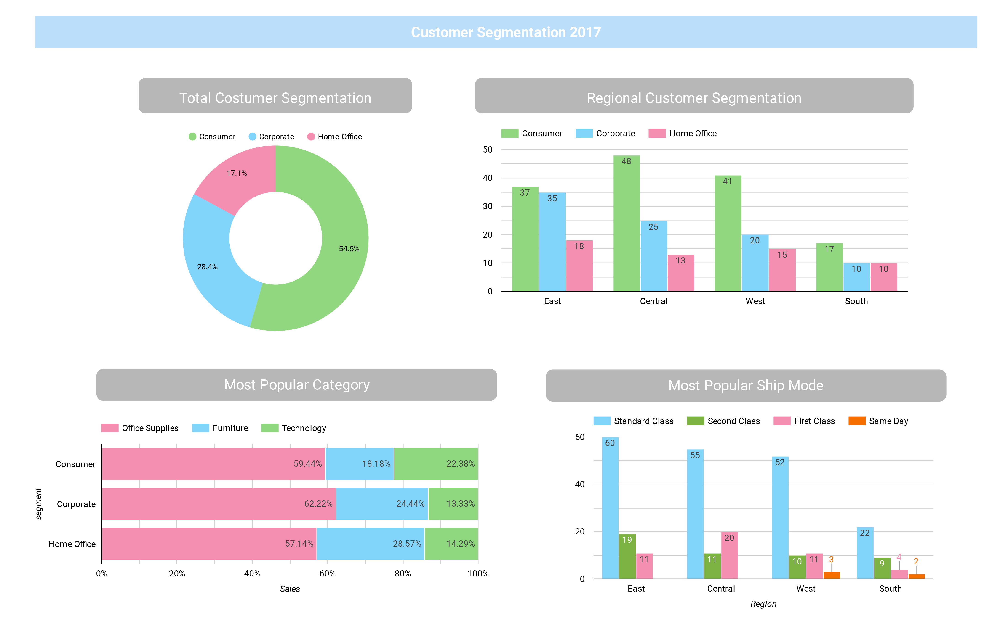

# Superstore Dashboard Analysis
Sample dataset ready in format .xls.

## Overview
Sample dataset from a retail from a global superstore. Dataset ready for 4 years (2015 - 2018). From the dataset, we could safely assume that they have variety of products from Technology, Furniture to Office Supplies with stores available in West, Central, East and South region. 

The purpose of the analysis is to prepare visualization that can give explanation to managers and stakeholders about the sales over the year, and to help them make insightful prediction for future sales decision. 
## Result
Tools : SQL query using google BigQuery, Data visualizaton using Looker Studio (GDS). 

- Overall Analysis

We can see how there are significant increases from previous year (2016). Which are the good signs that business is thriving. Total yearly sales performance also increases each month be it in year 2016 or year 2017. Breaking down to the Total Profit Performance, we can see how the highest discount also has the highest sales at the time, but having less profit on Nov 2017. This could mean that they're selling out-of-season items, or seasonal sales at the time. We can also point out on June, where both discount and profit increased. We can later identify, what products that have been successfully giving profit despite they're discounted items. 

- Monthly Sales Performance Breakdown

Here we can see the detailed profit and sales that are made during the month. In January we can safely assume that the business is thriving since the profit went up despite the sales are down. 

- Category Product Sales

To identify products that has sell well and which region contribute the most profit to the company, we are using the bar chart. As it seems, the west region contribute overall both the most sales and profit during the year 2017 with technology product as the most popular product. In South, in the other hand seems to have lowest profit but highest sales on Technology products. 

It is possible in the South, they have a lot of technology products on discount thus not contribute well in profit despite they sell well. But, if we looking on the Region with the most order, South in particular has the least order. We need to look more at the improvement for South. It is possible that they have discount on wrong category items, or not advertising their products well so less people buy from their store. 

- Customer Segmentation

To have more insight on what people bought in the store, we put it under the customer segmentation. It is shown that most people registered under costumer segmentation with the most people registered are from Central. 
Here we can see that most consumer bought Office Supplies regardless they're registered under Corporate or Home Office. With technology being the least popular. It is possible since Office Supplies product is more as a consumable small items like binders, scissors, etc that most people needs on their everyday use. While, technology being the least popular, it is the most profitable product since they are more expensive. 

We can also see how the most used shipping mode is standard class. It is possible to increase the use on the other ship mode through promotion or advertising. 

