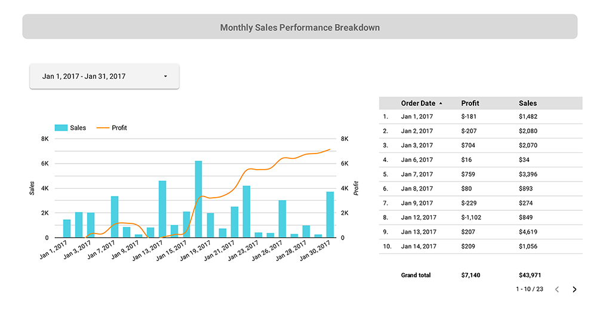

# Superstore Dashboard Analysis
Sample dataset ready in format .xls.

## Overview
Sample dataset from a retail from a global superstore. Dataset ready for 4 years (2015 - 2018). 
The purpose of the analysis is to prepare visualization that can give explanation to managers and stakeholders about the sales over the year, and to help them make insightful prediction for future sales decision. 

## Result
Tools : SQL query using google BigQuery, Data visualizaton using Looker Studio (GDS). 

- Overall Analysis

We can see how there are significant increases from previous year (2016). Which are the good signs that business is thriving. Total yearly sales performance also increases each month be it in year 2016 or year 2017. Breaking down to the Total Profit Performance, we can see how the highest discount also has the highest sales at the time, and less profit on Nov 2017. This could mean that they're selling out-of-season items, or seasonal sales at the time. 

- b

- c

- d 

